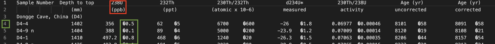
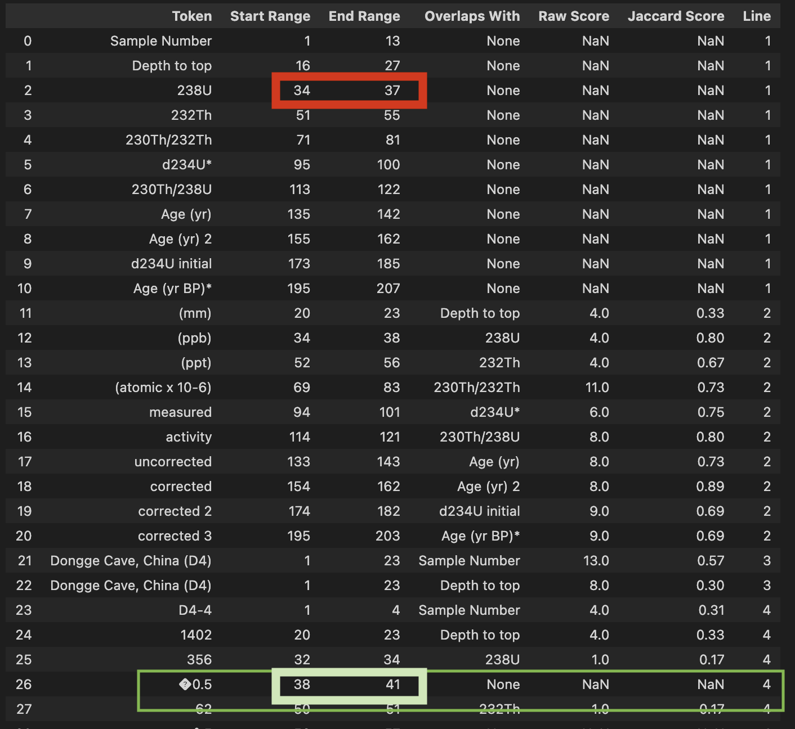

### Objective: 
Detect the header for given token. 

### Intuition: 
Match tokens to headers based on positional overlaps. 

### Methodology
- For each token, append positional range. 
- Define headers: Currently assumes 1st line as header by default. (Working a method to classify the extent of header rows. If multi header, the range of each header cell shall be adjusted based on the largest sub element width)
- Calculate overlap strengths of each body element with header element. 
- (Currently) Element that overlaps with any header is assigned that particular header. 

### Improvement: 
- In case of multiple overlaps, break ties to header with stronger overlaps
- If a tag has no overlaps with any header, assign it to the header which is immediate right to the current free token 
e.g. Visually the elements seem to overlap.  However, [Notebook: Dataframe 1: row 26]  shows the element "�0.5" starts at 38 and end and 41. The header above spans for 34-37. Hence, "�0.5" becoomes a free token. Best estimate in such cases would be to assign it to the immediate rightmost header.