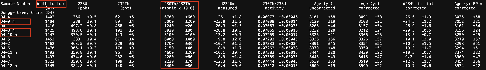
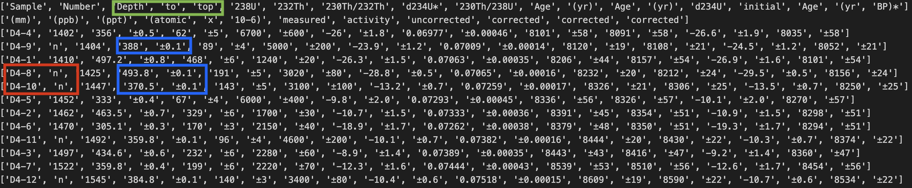

## Intro:
The NOAA database consists of studies for paleoclimate data, where each study has multiple sites, and each of these sites can have multiple fileUrls. 
The scientific data related to these studies are found in these fileUrls.


### Analysis: 
There are 73337 unqiue files belonging to 12951 studies. Majority of the file types are NOAA txt files. 
Out of these 12951 studies, we are able to read at least one file per study for approximately 10,000 studies. 
Out of the remianing studies, we have approximately 1500 studies that have non standard/ old format of writing tables.

tldr; currently we have a Rule based parser that is able to cover up at least 10,000 studies from NOAA database.
Current options: cover 400 extra studies by making a xls/xlsx parser or cover 1500 studies by another non standard text parser.


## PARSERS:


### Rule Based Parser:
The standard files (description -> "Formatted Data", "NOAA Templated" or similar) strictly follow a specific structure. These files have two sub-structures: 

- (a)  Metadata Block -> **Given by the commented lines i.e. #** and majorly contain information of the study like Publication, author, Originial Site reference, etc. 
    We are interested in the variable block of this metadata portion, to extract variables (Most of the times variables are found on lines starting with ##). The variables from metadata block form column headers in the data block.
- (b)  Data Block -> A block of lines containing tab delimited data. Some of these lines may be having leading tab spaces, which break homogenity of the data block (Please read the How the Pandas create dataframe section).
- (c)  The current parser will parse the data datablock, and ensure the shape of the extrcted data is homogenous by either resricting the row length to variables length if whitespaces are present, or extend the datablock if important information has to be accomodated.

### xls/xlsx Parser:
- (a)  Out of 400 studies, approximately 200 studies have xls/xlsx workbooks with 1 table per sheet. 
- (b)  For the rest 200 files, we will need a robust parser that differentaites the tables boundaries and extracts all tables accurately.  

### WhiteSpace Delimiter/ Running Length Estimator based parser:
- The structure of non standard files are similar to standard templated files. The differentiating factor is that the metadata blocks are not marked by ##. Hence, separating the data from metadata is difficult. Sometimes (No numerical estimates available currently), the data is found below lines starting from "DATA:"
- Current parser (Whitespace Delimiter + Merge Blocks): 
    - Delimiting Lines: considers a window of 5 lines at a time. Within these 5 lines, number of elements are counted by delimiting a line. We check for variance of number of elements in this block.
    - Block Formation: By checking the variance scores of each block, if the combined variance is below a certain threshold, the blocks are merged. 
    PS: Reasn to choose this method:
    There is no place holder which can tell us a cell value is missing. 
    - For e.g. Consider, 
    ```python
    #Tab delimited example:
    line = "123\t123\t\t123"
    line.split("\t")
    
    Output:
    ['123', '123', '', '123']

    #whitespace delimited example:
    line1 = "123   123        123"
    line2 = "123   123   123  123"
    lines = [
    "data11 data12 data13",    #line 1
    "data21 data22 data23",    #line 2
    "data31 data33",           #line 3
    "data41",                  #line 4
    "data51 data52 data53",    #line 5
    "data61 data62 data63",    #line 6
    "data51 data52 data53",    #line 7
    "data61 data62 data63"     #line 8
    ]
    print(line1.split())
    print(line1.split())
    for line in lines:
        print(line.split())

    Ouput:
    ['123', '123', '123']
    ['123', '123', '123']
    
    ['data11', 'data12', 'data13']
    ['data21', 'data22', 'data23']
    ['data31', 'data33']
    ['data41']
    ['data51', 'data52', 'data53']
    ['data61', 'data62', 'data63']
    ['data51', 'data52', 'data53']
    ['data61', 'data62', 'data63']
    ```
    If a row ends with a single or multiple NULL values, then the run of consistent lengths breaks. We have to repetitively check if that row is consistent with other blcoks or not. Whereas, the variance method would decide if that particular line is a part of current block by checking the surrounding rows. 

    Shortcomings of the parser:
    - This parser detects blocks for alot of data. But fails to detect the column boundaries. 
    
    e.g. 1. Since the data is not tab delimited, picking a sequence of words is difficult. Eg. 
    
    ```python
    #Tab delimited example:
    line = "123\t123 456\t123\t123"
    line.split("\t")
    
    Output:
    ['123', '123 456', '123', '123']     

    #whitespace delimited example:
    line1 = "123   123 456     123    123"
    line.split()

    Output: 
    ['123', '123', '456', '123', '123']
    ```
    
    e.g. 2. Special case:
    
    
    Delimition Output:
    
    estimating the delimition type in such files is difficult. 
    Since each file would have to be checked manually, finding estimates of such edge cases is also difficult (estimate would be provided soon). [For the amount of files that I have gone through, many of these manually generated files, will have an excel alternate]
    
    Solution:
    - Opt 1. Make the parser decide based on the position of element/character (i.e. positional encoding), comparison of datatype within consecutive blocks
    i.e. Parser is just delimiting the words based on whitespace, what we need is a separator boundary which will separate divide the lines in consistent cells.
    - Opt 2. Fallback to the xls file if available.

    The model which has been trained on the dataset scarpped from standard text file would not work in case of detecting cell values. Reason being, the variables in standard template files are a single worded concatenated by "_" i.e. Our classify would definitely classify token "Depth" as a variable/header, but would fail to dtermine the complete header "Depth to Top" in the above image example.


## HOW ARE DATAFRAMES CREATED USING PANDAS:
To build a dataframe, we need headers (optional), data block (required)
The size of the datablock should be homogenous. i.e. All rows must have equal number of elements on each line. 
If the number of elements in each line are inconsistent, we get error:
```python
# There are 4 column titles defined
col_titles = ['col1', 'col2', 'col3', 'col4']

data = [['data1', 'data2', 'data3', 'data4'],        # four columns
        ["blue", 'red', 'green', 'orange','silver']] # five columns

df = pd.DataFrame(data, columns = col_titles)

print('\n', df)

ValueError: Number of columns passed 4, passed data had 5 columns
```